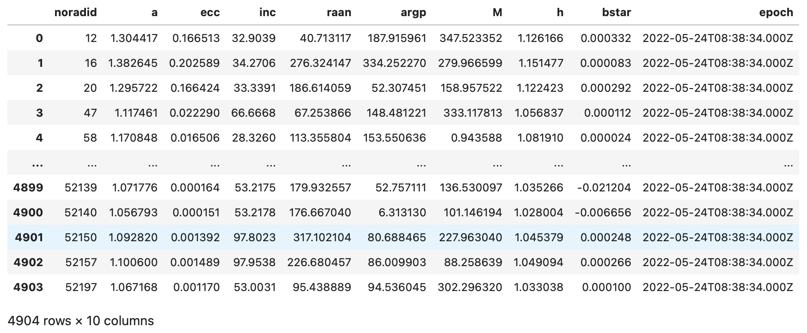

# Welcome to the ORBDTOOLS package

[](https://pypi.python.org/pypi/orbdtools/) [](https://pypi.python.org/pypi/orbdtools/) [](https://pypi.python.org/pypi/orbdtools/) [](https://GitHub.com/lcx366/ORBDTOOLS/graphs/contributors/) [](https://GitHub.com/lcx366/ORBDTOOLS/graphs/commit-activity) [](https://github.com/lcx366/ORBDTOOLS/blob/master/LICENSE) [](http://orbdtools.readthedocs.io/?badge=latest) [](https://travis-ci.org/lcx366/orbdtools)

This package is on its way to become an archive of scientific routines for data processing related to Arc Matching, Arc Associating, Initial Orbit Determination(IOD), Cataloging OD, and Precise OD. Currently, the package only implements a small number of functional modules, and subsequent new modules will be added and updated one after another. So far, operations on Arc Matching include:

1. Matching of angle measurement data to space objects with TLE file; 
2. Matching of spaced-based radar measurement data(range+angle) to space objects with TLE file;
3. Data processing related to TLE file:
   - Reading and parsing of TLE file
   - Calculation of the mean orbital elements(only long-term items are considered) in a certain epoch
   - Orbital Propagation using SGP4/SDP4

## How to Install

On Linux, macOS and Windows architectures, the binary wheels can be installed using `pip` by executing one of the following commands:

```
pip install orbdtools
pip install orbdtools --upgrade # to upgrade a pre-existing installation
```

## How to use

### Transformation between Classical Orbital Elements (COE) and State Vectors

Convert classical orbital elements to state vectors.

```python
>>> from orbdtools import KeprvTrans
>>> import numpy as np
>>> # classical orbital elements in form of [a, e, i, Ω, ω, ν]
>>> coe = np.array([7000,0.01,50,100,30,210]) # semi major axis is in [km], and angles are in [deg]
>>> mu = 398600.4418 # GM for the Reference Earth Model - WGS84, [km^3/s^2] 
>>> rv = KeprvTrans.coe2rv(coe,mu)
>>> print(rv)
>>> # [ 4.48364689e+03 -2.79409408e+03 -4.68399786e+03  1.21885031e+00 6.81282168e+00 -2.84038655e+00]
>>> # For non-dimensional/dimensionless orbital elements
>>> coe_nd = np.array([1.0974,0.01,50,100,30,210]) # semi major axis is in non-dimensional length unit [L_nd]. For the Reference Earth Model - WGS84, [L_nd]=6378.137 [km] as the equatorial radius.  
>>> mu_nd = 1.5 # GM of the central attraction in non-dimensional unit [mu_nd]. For the Reference Earth Model - WGS84, [mu_nd]=398600.4418 [km^3/s^2].
>>> rv_nd = KeprvTrans.coe2rv(coe_nd,mu_nd)
>>> print(rv_nd)
>>> # [ 0.70290773 -0.43803412 -0.73431704  0.18883985  1.05552933 -0.44006895]
```

Revert  to classical orbital elements from state vectors.

```python
>>> from orbdtools import KeprvTrans
>>> import numpy as np
>>> rvs = np.array([[ 4.48e+03, -2.79e+03, -4.68e+03,  1.22e+00,6.81e+00, -2.84e+00],[ 5.48e+03, -3.79e+03, -5.68e+03,  1.52e+00,7.81e+00, -3.84e+00]])
>>> mu = 398600.4418 # GM for the Reference Earth Model - WGS84, [km^3/s^2] 
>>> coe = KeprvTrans.rv2coe(rvs,mu)
>>> print(coe)
>>> # [[6.98242989e+03 1.12195221e-02 4.99946032e+01 9.99954947e+01 3.60288078e+01 2.03986947e+02] [3.06604952e+04 7.14457354e-01 5.11123776e+01 1.01894775e+02 2.35493764e+02 9.61451955e-01]]
>>> # For non-dimensional/dimensionless state vectors
>>> # The non-dimensional time unit [T_nd] is defined by sqrt([L_nd]**3/[mu_nd]), and non-dimensional velocity unit [v_nd] is defined by [L_nd]/[T_nd]
>>> rvs_nd = np.array([[ 0.70239946, -0.43743181, -0.73375658,  0.15432556,  0.86144022,-0.35924967],[ 0.85918506, -0.5942174 , -0.89054218,  0.19227447,  0.98793658,-0.48574603]])
>>> mu_nd = 1.5 
>>> coe_nd = KeprvTrans.rv2coe(rvs_nd,mu_nd)
>>> print(coe_nd)
```

### Transformation among Classical Orbital Elements

Convert to True Anomaly from Mean anomaly.

```python
>>> from orbdtools import OrbeleTrans
>>> # For elliptic trajectories
>>> Me = 100 # Mean anomaly in [deg]
>>> ecc = 0.1 # Eccentricity
>>> nu = OrbeleTrans.Me_to_nu(Me,ecc)
>>> print(nu)
>>> #For hyperbolic trajectories
>>> Mh = 100 # Mean anomaly in [deg]
>>> ecc = 1.1 # Eccentricity
>>> nu = OrbeleTrans.Mh_to_nu(Mh,ecc)
>>> print(nu)
>>> # For parabolic trajectories
>>> Mp = 100 # Mean anomaly in [deg]
>>> ecc = 1 # Eccentricity
>>> nu = OrbeleTrans.Mp_to_nu(Mp,ecc)
>>> print(nu)
>>> # 110.97777806171158
>>> # 147.3000454161361
>>> # 120.18911304875806
```

#### Transformation between non-singular orbital elements and classical orbital elements for elliptic trajectories

Convert to non-singular orbital elements from classical orbital elements.

The non-singular orbital elements exhibit no singularity of ω for near-circular orbit. It is also known as the first kind of non-singular orbital elements.

```python
>>> a,ecc,inc,raan,argp,nu = 1.2,0.1,50,60,70,80
>>> a,inc,raan,xi,eta,l = OrbeleTrans.coe2nse(a,ecc,inc,raan,argp,nu)
>>> print(a,inc,raan,xi,eta,l)
>>> # 1.2 50 60 0.03420201433256689 0.09396926207859084 138.87814991243528
```

Revert to classical orbital elements from non-singular orbital elements.

```python
>>> a,inc,raan,xi,eta,l = 1.2,50,60,0.0342,0.0940,138.8781
>>> a,ecc,inc,raan,argp,nu = OrbeleTrans.nse2coe(a,inc,raan,xi,eta,l)
>>> print(a,ecc,inc,raan,argp,nu)
>>> # 1.2 0.1000281960249209 50 60 70.00710602013012 79.99572274415195
```

Convert to modified equinoctial orbital elements from classical orbital elements.

The modified equinoctial orbital elements exhibit no singularity of both ω and Ω for near-circular orbit with orbital plane close to equator. It is also known as the second kind of non-singular orbital elements.

```python
>>> a,ecc,inc,raan,argp,nu = 1.2,0.1,0.01,60,70,80
>>> p,f,g,h,k,L = OrbeleTrans.coe2mee(a,ecc,inc,raan,argp,nu)
>>> print(p,f,g,h,k,L)
>>> # 1.188 -0.06427876096865393 0.07660444431189782 4.363323141062026e-05 7.557497370160451e-05 198.87814991243528
```

Revert to classical orbital elements from modified equinoctial orbital elements.

```python
>>> p,f,g,h,k,L = 1.188,-0.0643,0.0766,4.3633e-05,7.5575e-05,198.8781
>>> a,ecc,inc,raan,argp,nu = OrbeleTrans.mee2coe(p,f,g,h,k,L)
>>> print(a,ecc,inc,raan,argp,nu)
>>> # 1.2000024848536301 0.10001024947474133 0.00999998935100991 60.00014021318978 70.0108175075162 79.98961193079703
```

#### Transformation between mean orbital elements and osculating orbital elements associated to SGP4/SDP4 propagator

Convert mean orbital elements to osculating orbital elements.

```python
>>> from orbdtools import OrbeleTrans
>>> from astropy.time import Time
>>> mean_ele = [7000,0.01,50,100,30,210] # in form of [a, e, i, Ω, ω, v] in TEME
>>> epoch = Time('2022-06-07T08:09:12.345')
>>> oscu_ele = OrbeleTrans.mean2osculating(mean_ele,epoch)
>>> print(oscu_ele)
>>> # [6.99736629e+03 1.06734477e-02 4.99907889e+01 1.00021727e+02 3.31317206e+01 2.06884978e+02]
```

Revert to mean orbital elements from osculating orbital elements.

```python
>>> from astropy.time import Time
>>> oscu_ele = [6.9974e+03,1.0673e-02,4.9991e+01,1.0002e+02,3.3132e+01,2.0688e+02] # in form of [a, e, i, Ω, ω, v] in TEME
>>> epoch = Time('2022-06-07T08:09:12.345')
>>> mean_ele = OrbeleTrans.osculating2mean(oscu_ele,epoch)
>>> print(mean_ele)
>>> # [7.00003366e+03 9.99954249e-03 5.00002077e+01 9.99982732e+01 3.00004171e+01 2.09994881e+02]
```

#### Transformation of classical orbital elements or state vectors between two reference frames

Transform classical orbital elements between two reference frames, especially between 'TEME' and 'GCRF'. What needs extra attention is that the reference frames on transformation must be defined as hand-right.

```python
>>> from orbdtools import OrbeleTrans
>>> from orbdtools import FrameTrans
>>> coe_from = [6.9974e+03,1.0673e-02,4.9991e+01,1.0002e+02,3.3132e+01,2.0688e+02] # in TEME
>>> trans_matrix = FrameTrans.gcrf_teme_mat(epoch)
>>> teme2gcrf_mat = trans_matrix.teme2gcrf_mat # transformation matrix from TEME to GCRF
>>> coe_to = OrbeleTrans.coe_trans(teme2gcrf_mat,coe_from)
>>> print(coe_to)
>>> # [6.99740000e+03 1.06730000e-02 5.01127908e+01 9.97161144e+01 3.31576626e+01 2.06880000e+02]
```

Transform state vector between two reference frames.

```python
>>> from orbdtools import OrbeleTrans
>>> rv_from = [4.4836e+03,-2.7941e+03,-4.6840e+03,1.2189,6.8128,-2.8404] # in unit of [km,km/s] in TEME
>>> rv_to = OrbeleTrans.rv_trans(teme2gcrf_mat,rv_from)
>>> print(rv_to)
>>> # [ 4.45943241e+03 -2.81665205e+03 -4.69355448e+03  1.24694023e+00 6.80654150e+00 -2.84323163e+00]
```

### Computation of matrix associated to transformation among a variety of reference frames

#### Calculate transformation matrix between Topocentric NEU(North East Up) and  ITRF(International Terrestrial Reference Frame).

Reference materials have slightly different definitions to the topocentric horizon coordinate system, and extra attention should be paid when using them.
For example, NEU(North East Up) is described by the python package *skyfield* and this package as that X points North, Y East, and Z Up.
SEZ(South East Zenith) is used by *Bate, Roger R., et al. Fundamentals of astrodynamics. Courier Dover Publications, 2020.* and *Vallado, D. A., and W. D. McClain. "Fundamentals of astrodynamics and applications 4th Edition." (2013).*;
ENZ(East North Zenith) is used by *Curtis, Howard. Orbital Mechanics for Engineering Students: Revised Reprint. Butterworth-Heinemann, 2020.*

```python
>>> from orbdtools import FrameTrans
>>> lon,lat = 102.5,25.2 # longitude and latitude in [deg]
>>> #lon,lat = [102.5,102,102.5],[25.2,26,16.5]
>>> matrix_trans = FrameTrans.topo_itrf_mat(lon,lat) 
>>> topo2itrf_mat = matrix_trans.topo2itrf_mat
>>> itrf2topo_mat = matrix_trans.itrf2topo_mat
```

#### Calculate the transformation matrix between GCRF(Geocentric Celestial Reference Frame)/ICRF(International Celestial Reference Frame) and  ITRF(International Terrestrial Reference Frame).

Ignoring the subtle effects of epoch offset, GCRF/ICRF is equivalent to the J2000(also EME2000, Earth's Mean Equator and Mean Equinox at 12:00 Terrestrial Time on 1 January 2000) reference frame in this package.

```python
>>> from astropy.time import Time
>>> ta = Time('2022-01-02T03:04:05.678') # UTC
>>> # ta = Time(['2022-01-02T03:04:05.678','2022-02-02T03:04:05.678']) # UTC
>>> from orbdtools import FrameTrans
>>> matrix_trans = FrameTrans.gcrf_itrf_mat(ta)
>>> gcrf2itrf_mat = matrix_trans.gcrf2itrf_mat
>>> itrf2gcrf_mat = matrix_trans.itrf2gcrf_mat
```

#### Calculate the transformation matrix between GCRF(Geocentric Celestial Reference Frame) and the topocentric NEU(North East Up) reference frame.

```python
>>> from orbdtools import FrameTrans
>>> from astropy.time import Time
>>> lon,lat = 102.5,25.2
>>> ta = Time(['2022-01-02T03:04:05.678']) # UTC
>>> #lon,lat = [102.5,102,102.5],[25.2,26,16.5]
>>> #ta = Time(['2022-01-02T03:04:05.678','2022-02-02T03:04:05.678']) # UTC
>>> matrix_trans = FrameTrans.gcrf_topo_mat(lon,lat,ta)
>>> gcrf2topo_mat = matrix_trans.gcrf2topo_mat
>>> topo2gcrf_mat = matrix_trans.topo2gcrf_mat
```

#### Calculate the transformation matrix between GCRF(Geocentric Celestial Reference Frame) and the TEME(True Equator, Mean Equinox) reference frame.

```python
>>> from orbdtools import FrameTrans
>>> from astropy.time import Time
>>> ta = Time('2022-01-02T03:04:05.678') # UTC
>>> #ta = Time(['2022-01-02T03:04:05.678','2022-02-02T03:04:05.678']) # UTC
>>> matrix_trans = FrameTrans.gcrf_teme_mat(ta)
>>> gcrf2teme_mat = matrix_trans.gcrf2teme_mat
>>> teme2gcrf_mat = matrix_trans.teme2gcrf_mat
```

#### Calculate the transformation matrix between the Earth Centred Inertial (ECI) reference frame and the PQW(perifocal) reference frame.

```python
>>> from orbdtools import FrameTrans
>>> inc,raan,argp = 30,40,50 # [i, Ω, ω] in unit of [deg]
>>> #inc,raan,argp = [30,40],[40,50],[50,60] # [i, Ω, ω] in unit of [deg]
>>> matrix_trans = FrameTrans.ECI_PQW_mat(inc,raan,argp)
>>> ECI2PQW_mat = matrix_trans.ECI2PQW_mat
>>> PQW2ECI_mat = matrix_trans.PQW2ECI_mat
```

#### Calculate the transformation matrix between the Earth Centred Inertial (ECI) reference frame and the RSW(x -> Radial, y -> Along-track, z -> Cross-track) reference frame.

```python
>>> from orbdtools import FrameTrans
>>> #inc,raan,argp,nu = 30,40,50,60 # [i, Ω, ω, v] in unit of [deg]
>>> inc,raan,argp,nu = [30,40],[40,50],[50,60],[60,70] # [i, Ω, ω, v] in unit of [deg]
>>> matrix_trans = FrameTrans.ECI_RSW_mat(inc,raan,argp,nu)
>>> ECI2RSW_mat = matrix_trans.ECI2RSW_mat
>>> RSW2ECI_mat = matrix_trans.RSW2ECI_mat
```

#### Calculate the transformation matrix between the Earth Centred Inertial (ECI) reference frame and the NTW(x -> Normal, y -> Tangent, z -> Cross-track) reference frame.

```python
>>> from orbdtools import FrameTrans
>>> ecc,inc,raan,argp,nu = 0.1,30,40,50,60 # [i, Ω, ω, v] in unit of [deg]
>>> #ecc,inc,raan,argp,nu = [0.1,0.2],[30,40],[40,50],[50,60],[60,70] # [i, Ω, ω, v] in unit of [deg]
>>> matrix_trans = FrameTrans.ECI_NTW_mat(ecc,inc,raan,argp,nu)
```

#### Calculate the transformation matrix between the Earth Centred Inertial (ECI) reference frame and the RADAR(x -> Along-track, y -> Cross-track, z -> Radial) reference frame.

```python
>>> from orbdtools import FrameTrans
>>> inc,raan,argp,nu = 30,40,50,60 # [i, Ω, ω, v] in unit of [deg]
>>> #inc,raan,argp,nu = [30,40],[40,50],[50,60],[60,70] # [i, Ω, ω, v] in unit of [deg]
>>> matrix_trans = FrameTrans.ECI_RADAR_mat(inc,raan,argp,nu)
>>> ECI2RADAR_mat = matrix_trans.ECI2RADAR_mat
>>> RADAR2ECI_mat = matrix_trans.RADAR2ECI_mat 
```

#### Calculate the rotation matrix between the RSW(x -> Radial, y -> Along-track, z -> Cross-track) reference frame and the Body-Fixed reference frame.

The transformation between the Body-Fixed(BF) reference frame and the Device-Fixed(DF) reference frame works the same way, and just replace `FrameTrans.RSW_BF_mat` with `FrameTrans.BF_DF_mat`.

```python
>>> from orbdtools import FrameTrans
>>> triad,mode = [20,30,40],'euler' # Classic 'ZXZ' rotation transform from RSW to BF
>>> # triad,mode = [20,30,40],'ypr' # Yaw(x)–Pitch(z)–Roll(y) rotation transform from RSW to BF
>>> # triad,mode = [[0,1,0],[0,0,1],[1,0,0]],'matrix' # Each column of matrix is the base vector of BF in RSW
>>> # triad,mode = [1,2,3,4],'quaternion' # Each row is a (possibly non-unit norm) quaternion in scalar-last (x, y, z, w) format.
>>> matrix_trans = FrameTrans.RSW_BF_mat(triad,mode)
>>> RSW2BF_mat = matrix_trans.RSW2BF_mat
>>> BF2RSW_mat = matrix_trans.BF2RSW_mat
>>>
>>> # For multiple dimension
>>> from orbdtools import FrameTrans
>>> triad,mode = [[20,30,40],[60,60,70]],'euler' # Classic 'ZXZ' rotation transform from RSW to BF
>>> #triad,mode = [[20,30,40],[60,60,70]],'ypr' # Yaw(x)–Pitch(z)–Roll(y) rotation transform from RSW to BF
>>> #triad,mode = [[[0,1,0],[0,0,1],[1,0,0]],[[0,-1,0],[0,0,1],[-1,0,0]]],'matrix' # Each column of matrix is the base vector of BF in RSW
>>> #triad,mode = [[1,2,3,4],[5,6,7,8]],'quaternion' # Each row is a (possibly non-unit norm) quaternion in scalar-last (x, y, z, w) format.
>>> matrix_trans = FrameTrans.RSW_BF_mat(triad,mode)
>>> RSW2BF_mat = matrix_trans.RSW2BF_mat
>>> BF2RSW_mat = matrix_trans.BF2RSW_mat
```

#### Calculate the rotation matrix between the Earth Centred Inertial(ECI) reference frame and the Device-Fixed(DF) reference frame.

```python
>>> from orbdtools import FrameTrans
>>> # For a single payload, a single time
>>> triad_RSWBF,mode_RSWBF = triad,mode = [20,30,40],'euler' # Classic 'ZXZ' rotation transform from RSW to BF
>>> triad_BFDF,mode_BFDF = [[0,1,0],[0,0,1],[1,0,0]],'matrix' # Each column of matrix is the base vector of DF in BF 
>>> orb_ele = [1.5,0.1,20,30,40,50]
>>> matrix_trans = FrameTrans.ECI_DF_mat(triad_RSWBF,mode_RSWBF,triad_BFDF,mode_BFDF,orb_ele)
>>>
>>> # For multiple payloads, a single time
>>> triad_BFDF,mode_BFDF = triad,mode = [[[0,1,0],[0,0,1],[1,0,0]],[[0,-1,0],[0,0,1],[-1,0,0]]],'matrix' # two payload devices
>>> matrix_trans = FrameTrans.ECI_DF_mat(triad_RSWBF,mode_RSWBF,triad_BFDF,mode_BFDF,orb_ele)
>>>
>>> # For a single payload, multiple time
>>> triad_BFDF,mode_BFDF = triad,mode = [[0,1,0],[0,0,1],[1,0,0]],'matrix' 
>>> orb_ele = [[1.5,0.1,20,30,40,50],[1.6,0.2,20,40,50,60]]
>>> #triad_RSWBF,mode_RSWBF = triad,mode = [[20,30,40],[60,60,70]],'euler' # Classic 'ZXZ' rotation transform from RSW to BF
>>> matrix_trans = FrameTrans.ECI_DF_mat(triad_RSWBF,mode_RSWBF,triad_BFDF,mode_BFDF,orb_ele)
>>>
>>> # For multiple payloads, multiple time
>>> triad_BFDF,mode_BFDF = triad,mode = [[[0,1,0],[0,0,1],[1,0,0]],[[0,-1,0],[0,0,1],[-1,0,0]]],'matrix' 
>>> orb_ele = [[1.5,0.1,20,30,40,50],[1.6,0.2,20,40,50,60]]
>>> #triad_RSWBF,mode_RSWBF = triad,mode = [[20,30,40],[60,60,70]],'euler' # Classic 'ZXZ' rotation transform from RSW to BF
>>> matrix_trans = FrameTrans.ECI_DF_mat(triad_RSWBF,mode_RSWBF,triad_BFDF,mode_BFDF,orb_ele)
>>> ECI2DF_mat = matrix_trans.ECI2DF_mat
>>> DF2ECI_mat = matrix_trans.DF2ECI_mat
```

The transformation of vectors from one reference frame to another can be calculated using `Matrix_dot_Vector` in `orbdtools.utils.math`.

### Data processing related to TLE files

#### Download TLE files from [SPACETRACK](https://www.space-track.org)

```python
>>> from orbdtools import TLE
>>> tle_file = TLE.download([52132,51454,37637,26758,44691])
>>> # tle_file = TLE.download('satno.txt')
```

A sample of  the *satno.txt* file is as follows:

```
#satno
12345
23469
45678
```

#### Read and parse a TLE file

```python
>>> import numpy as np
>>> tle_file = 'test/tle_20220524.txt'
>>> epoch_obs = '2022-05-24T08:38:34.000Z' # Approximate epoch of the observed arc, which is optional
>>> tle = TLE.from_file(tle_file,epoch_obs) # Only TLEs within a week before and after the observation epoch are considered
>>> # tle = TLE.from_file(tle_file) # All TLEs are considered
>>> print(tle.range_epoch) # Epoch coverage for TLE files in format of [min, median, max]
>>> print(tle.df)
```

    ['2022-05-18T23:07:15.444Z', '2022-05-23T22:00:02.000Z', '2022-05-24T06:32:39.874Z']

<p align="middle">
  
</p>

#### Calculate the mean orbital elements at a certain epoch

```python
>>> tle_epoch = tle.atEpoch(epoch_obs)
>>> print(tle_epoch.df)
```

<p align="middle">
  
</p>

#### Orbital Propagation

##### Calculate the cartesian coordinates of space objects in GCRF(Geocentric Celetial Reference Frame) over a period of time

```python
>>> t_list = ['2022-05-23T16:22:49.408Z', '2022-05-23T18:48:34.488Z',
           '2022-05-23T18:09:35.640Z', '2022-05-23T20:54:20.228Z',
           '2022-05-23T20:29:03.621Z', '2022-05-23T23:24:11.831Z',
           '2022-05-24T00:38:08.803Z', '2022-05-24T02:33:32.466Z',
           '2022-05-23T21:10:37.703Z', '2022-05-23T17:48:24.865Z']
>>> xyz_gcrf = tle.predict(t_list)
>>> # sats_id = [47,58,52139,52140,52150] # Norad IDs of space objects
>>> # xyz_gcrf = tle.predict(t_list,sats_id)
>>> print(xyz_gcrf.shape)
```

    (4904, 10, 3)

### Arc Matching

#### For optical angle-only measurements

Load the observation file and extract the optical angle-only measurement data.

```python
>>> import numpy as np
>>> obs_data = np.loadtxt('test/optical_obs.dat',dtype=str,skiprows=1) # Load the observation file
>>> # extract the necessary data
>>> t = obs_data[:,0] # Obsevation time in UTC
>>> xyz_site = obs_data[:,1:4].astype(float) # Cartesian coordinates of the site in GCRF, [km]
>>> radec = obs_data[:,4:6].astype(float) # Ra and Dec of space object, [deg]
```

Match the arc to space objects with TLE file.

```python
>>> from orbdtools import ArcObs
>>> arc_optical = ArcObs({'t':t,'radec':radec,'xyz_site':xyz_site}) # Load the necessary data
>>> 
>>> # Use the LOWESS(LOcally Weighted Scatterplot Smoothing) method to remove outliers, optional
>>> arc_optical.lowess_smooth() 
>>> arc_optical.arc_match(tle) # Match the observation arc to TLE
>>> 
>>> print(arc_optical.code_match)
>>> print(arc_optical.satnum)
>>> print(arc_optical.disp_match)
```

    1
    1616
    Target ID: 1616

Three types of matching results are summaried as follows

| Match Code | Object ID         | Solution Case      | Status  | What to Do Next    |
|:----------:|:-----------------:|:------------------:|:-------:|:------------------:|
| 1          | NORAD ID          | Unique solution    | Success |                    |
| 0          | None              | No solution        | Failure | increase threshold |
| -1         | list of NORAD IDs | Multiple solutions | Failure | decrease threshold |

#### For space-based radar range+angle measurements

Load the observation file and extract the space-based radar measurement data. 

```python
>>> import numpy as np
>>> 
>>> obs_data = np.loadtxt('test/radar_obs.dat',dtype=str,skiprows=1) # Load the observation file
>>> # extract the necessary data
>>> t = obs_data[:,0] # Obsevation time in UTC
>>> orbele_site = obs_data[:,1:7].astype(float) # Orbital elements(a,ecc,inc,raan,argp,true_anomaly) of the site
>>> xyz_site = obs_data[:,7:10].astype(float) # Cartesian coordinates of the site in GCRF, [km]
>>> azalt = obs_data[:,10:12].astype(float) # Azimuth and Altitude angle of space object, [deg]
>>> r = obs_data[:,12].astype(float) # Slant distance of the space object relative to the site, [km]
```

Match the arc to space objects with TLE file. Note: the RADAR reference frame is defined as right-handed with x:Along-track,y:Cross-track,z:Radial; azimuth is measured clockwise from the x-axis.

```python
>>> from orbdtools import ArcObs
>>> arc_radar = ArcObs({'t':t,'azalt':azalt,'r':r,'xyz_site':xyz_site,'orbele_site':orbele_site}) # Load the necessary data
>>> arc_radar.lowess_smooth()
>>> arc_radar.arc_match(tle)
>>> 
>>> print(arc_radar.code_match)
>>> print(arc_radar.satnum)
>>> print(arc_radar.disp_match)
```

    1
    1616
    Target ID: 1616

### Implementation of some classic Initial Orbit Determination methods

For optical angle-only measurement data, the methods of **Near-Circular Orbit Hypothesis**, **Gauss**, **Laplace**, **Multiple-points Laplace**, **Double-R**, **Gooding**, and **FG-Series** are provided for determining the initial orbit of space objects in this package. For radar range+angle measurement data, the methods of **Gibbs/Herrick-Gibbs** and **Elliptical Orbit Fitting** are provided for determining the initial orbit of space objects in this package.

Here we use ground-based optical angle-only  measurements, space-based optical angle-only measurements and radar range+angle measurements as examples to test various  IOD methods and compare them with real orbits from TLE.

Extract the necessary information for Initial Orbit Determination(IOD) from **ground-based optical angle-only** measurements.

```python
>>> import numpy as np
>>> obs_data = np.loadtxt('test5/T25872_KUN2_2.dat',dtype=str,skiprows=1) # Load the observation file
>>> obs_data = obs_data[::10]
>>> # Extract the necessary data
>>> t = obs_data[:,0] # Obsevation time in UTC
>>> radec = obs_data[:,1:3].astype(float) # Ra and Dec of the space object, in [hour,deg]
>>> xyz_site = obs_data[:,3:6].astype(float) # Cartesian coordinates of the site in GCRF, in [km]
>>> radec[:,0] *= 15 # Convert hour angle to degrees
```

Load the extracted data to `ArcObs`, and eliminate outliers using the method of LOWESS.

```python
>>> from orbdtools import ArcObs
>>> arc_optical = ArcObs({'t':t,'radec':radec,'xyz_site':xyz_site})
>>> arc_optical.lowess_smooth() # Eliminate outliers using the method of LOWESS
```

Set the *Earth* as the central body of attraction.

```python
>>> from orbdtools import Body
>>> earth = Body.from_name('Earth')
>>> arc_iod = arc_optical.iod(earth)
```

#### Near-Circular Orbit Hypothesis method

The traditional two-point Near-Circular Orbit Hypothesis method is improved by combining the three-point Gibbs/Herrick-Gibbs method in this package. For more information about the traditional method, please refer to 

- *张晓祥,吴连大,熊建宁.空间目标的圆轨道跟踪法[J].天文学报, 2003, 44(4):11.DOI:10.3321/j.issn:0001-5245.2003.04.010.*

```python
>>> arc_iod.circular(ellipse_only=False)
>>> print(arc_iod.df.to_string())
>>> #                      epoch         a       ecc       inc       raan        argp     nu      M         h   status
>>> # 0  2022-01-18T21:31:36.000  1.310295  0.000002  52.01579  51.568628  314.478385  180.0  180.0  1.144681  success
```

The optional parameter `ellipse_only` is a switch for filtering out elliptical orbits with semi-major axis greater than the equatorial radius of the central body and O-C less than the preset threshold. If True, only elliptical orbits are considered as valid, otherwise all orbits including parabolic and hyperbolic orbits are considered as valid.

#### Gauss method

For more information about the method, please refer to 

- *Curtis H D. Orbital Mechanics for Engineering Students: Revised 4th edition[M]. Butterworth-Heinemann, 2020.*

```python
>>> arc_iod.gauss(ellipse_only=False)
>>> print(arc_iod.df.to_string())
>>> #                      epoch         a      ecc        inc       raan        argp          nu           M         h   status
>>> # 0  2022-01-18T21:31:36.000  1.313445  0.00228  52.038608  51.553549  148.236551  346.253751  346.315736  1.146053  success
```

#### Laplace method

For more information about the method, please refer to

- *Vallado D. Fundamentals of Astrodynamics and Applications(4th)[M], Microcosm Press, 2013.*

- *Bate R R, Mueller D D, White J E, et al. Fundamentals of astrodynamics(2nd)[M]. Courier Dover Publications, 2020.*

```python
>>> arc_iod.laplace(ellipse_only=False)
>>> print(arc_iod.df.to_string())
>>> #                      epoch         a       ecc        inc       raan        argp          nu           M         h  status
>>> # 0  2022-01-18T21:31:36.000  1.135273  0.224665  52.795486  54.588879  325.396385  168.002859  161.612157  1.038254  failed
```

#### Multiple-points Laplace method

For more information about the method, please refer to

- *Bate R R, Mueller D D, White J E, et al. Fundamentals of astrodynamics(2nd)[M]. Courier Dover Publications, 2020.*

```python
>>> arc_iod.multilaplace(ellipse_only=False)
>>> print(arc_iod.df.to_string())
>>> #                      epoch         a       ecc        inc       raan        argp          nu           M         h  status
>>> # 0  2022-01-18T21:31:36.000  1.275725  0.072221  53.501942  53.019178  325.045457  168.931844  167.254415  1.126531  failed
```

#### Double-R method

The traditional three-point Double-R method is improved by combining the three-point Gibbs/Herrick-Gibbs method in this package. For more information about the traditional method, please refer to

- Vallado D. Fundamentals of Astrodynamics and Applications(4th)[M], Microcosm Press, 2013.

```python
>>> arc_iod.doubleR(ellipse_only=False)
>>> print(arc_iod.df.to_string())
>>> #                      epoch         a       ecc        inc       raan        argp          nu           M         h   status
>>> # 0  2022-01-18T21:31:36.000  1.313601  0.002381  52.039102  51.554024  147.573208  346.917006  346.978664  1.146121  success
```

#### Gooding method

For more information about the method, please refer to

- *Gooding R H. A new procedure for the solution of the classical problem of minimal orbit determination from three lines of sight[J]. Celestial Mechanics and Dynamical Astronomy, 1996, 66: 387-423.*
- *Izzo D. Revisiting Lambert’s problem[J]. Celestial Mechanics and Dynamical Astronomy, 2015, 121: 1-15.*
- *Curtis H D. Orbital Mechanics for Engineering Students: Revised 4th edition[M]. Butterworth-Heinemann, 2020.*

```python
>>> # solve the Lambert's problem with the universal variable method
>>> ele_dict = arc_iod.gooding(method='universal',ellipse_only=False)
>>> print(arc_iod.df.to_string())
>>> #                      epoch         a       ecc        inc      raan        argp     nu      M         h   status
>>> # 0  2022-01-18T21:31:36.000  1.310295  0.000003  52.009667  51.56095  314.498906  180.0  180.0  1.144681  success
>>> # solve the Lambert's problem with the method by Izzo
>>> arc_iod.gooding(method='izzo',ellipse_only=False)
>>> print(arc_iod.df.to_string())
>>> #                      epoch         a       ecc        inc      raan        argp     nu      M         h   status
>>> # 0  2022-01-18T21:31:36.000  1.310295  0.000003  52.009667  51.56095  314.498906  180.0  180.0  1.144681  success
```

#### FG-Series method

For more information about the method, please refer to

- *李光宇.天体测量和天体力学基础[M].科学出版社,2015.*

- *刘林.卫星轨道力学算法[M].南京大学出版社,2019.*

- *Bate R R, Mueller D D, White J E, et al. Fundamentals of astrodynamics(2nd)[M]. Courier Dover Publications, 2020.*

```python
>>> arc_iod.fg_series(ellipse_only=False)
>>> print(arc_iod.df.to_string())
>>> #                      epoch        a      ecc        inc       raan        argp          nu           M         h   status
>>> # 0  2022-01-18T21:31:36.000  1.31294  0.00191  52.036942  51.554157  149.873847  344.616532  344.674512  1.145834  success
```

Compare the results with real orbits from TLE.

```python
>>> from orbdtools import TLE
>>> tle_file = 'test5/tle_20220119.txt'
>>> tle = TLE.from_file(tle_file)
>>> tle_update = tle.atEpoch('2022-01-18T21:31:36.000')
>>> tle_df = tle_update.df
>>> sat_df = tle_df[tle_df['noradid']==25872]
>>> print(sat_df.to_string())
>>> #       noradid         a       ecc      inc       raan       argp           M        h     bstar                     epoch
>>> # 1900    25872  1.312288  0.001365  51.9388  51.796242  187.68949  306.956591  1.14555  0.000343  2022-01-18T21:31:36.000Z
```

For the **space-based optical angle-only** measurements, we use the same processing flow as the ground-based measurements to test IOD methods mentioned above.

```python
>>> import numpy as np
>>> obs_data = np.loadtxt('test3/T22694_S1_1_C5_1.dat',dtype=str,skiprows=1) # Load the observation file
>>> obs_data = obs_data[::5]
>>> # extract the necessary data
>>> t = obs_data[:,0] # Obsevation time in UTC
>>> radec = obs_data[:,1:3].astype(float) # Ra and Dec of space object, in [deg]
>>> radec[:,0] *= 15 # Convert hours to degrees
>>> xyz_site = obs_data[:,3:6].astype(float) # Cartesian coordinates of the site in GCRF, [km]
>>> from orbdtools import ArcObs
>>> arc_optical = ArcObs({'t':t,'radec':radec,'xyz_site':xyz_site}) # Load the necessary data
>>> arc_optical.lowess_smooth()
>>> arc_iod.circular(ellipse_only=False)
>>> print(arc_iod.df.to_string())
>>> arc_iod.gauss(ellipse_only=False)
>>> print(arc_iod.df.to_string())
>>> arc_iod.laplace(ellipse_only=False)
>>> print(arc_iod.df.to_string())
>>> arc_iod.multilaplace(ellipse_only=False)
>>> print(arc_iod.df.to_string())
>>> arc_iod.doubleR(ellipse_only=False)
>>> print(arc_iod.df.to_string())
>>> ele_dict = arc_iod.gooding(method='universal',ellipse_only=False)
>>> print(arc_iod.df.to_string())
>>> arc_iod.gooding(method='izzo',ellipse_only=False)
>>> print(arc_iod.df.to_string())
>>> arc_iod.fg_series(ellipse_only=False)
>>> print(arc_iod.df.to_string())
>>>                      epoch         a           ecc        inc        raan        argp          nu           M            h   status
>>> 0  2022-03-24T19:43:11.000  6.620564      0.000002  15.122863    6.748521  184.996759    1.038925     1.03892     2.573046  success
>>>                      epoch         a           ecc        inc        raan        argp          nu           M            h   status
>>> 0  2022-03-24T19:43:11.000 -0.002950  77687.676046  45.163396  286.360923  179.950664    8.310002  333.175406  4219.232928   failed
>>> 1  2022-03-24T19:43:11.000  6.859966      0.025903  18.530465    3.513682  170.273591   15.725365   14.935701     2.618275  success
>>> 2  2022-03-24T19:43:11.000  6.616976      0.007160   2.819296  204.772918  181.406380  184.848294  184.918012     2.572282   failed
>>>                      epoch         a           ecc        inc        raan        argp          nu           M            h   status
>>> 0  2022-03-24T19:43:11.000 -0.002950  77704.757170  45.163444  286.360610  179.949294    8.311361  223.906534  4220.111239   failed
>>> 1  2022-03-24T19:43:11.000  6.859363      0.025809  18.531228    3.511614  170.260444   15.738826   14.951304     2.618166  success
>>> 2  2022-03-24T19:43:11.000  6.616654      0.007214   2.820695  204.774097  181.496819  184.758445  184.827393     2.572219   failed
>>>                      epoch         a           ecc        inc        raan        argp          nu           M            h   status
>>> 0  2022-03-24T19:43:11.000 -0.029135   2520.867018  44.311504  279.565977    0.649530    7.579402  123.613228   430.287289   failed
>>> 1  2022-03-24T19:43:11.000  6.548644      0.008583   0.345056   21.958307    1.134312  184.607814  184.687336     2.558938  success
>>> 2  2022-03-24T19:43:11.000  6.422555      0.022935  10.780522   11.045074  356.693901  189.357780  189.792484     2.533609  success
>>>                      epoch         a           ecc        inc        raan        argp          nu           M            h   status
>>> 0  2022-03-24T19:43:11.000  6.455367      0.025672  15.406771    6.858407   10.275297  175.652244  175.424872     2.539904  success
>>>                      epoch         a           ecc        inc        raan        argp          nu           M            h   status
>>> 0  2022-03-24T19:43:11.000  6.620564      0.000002  15.122845    6.749191  186.035035    0.000815    0.000815     2.573046  success
>>>                      epoch         a           ecc        inc        raan        argp          nu           M            h   status
>>> 0  2022-03-24T19:43:11.000  6.620564      0.000002  15.122845    6.749191  186.035035    0.000815    0.000815     2.573046  success
>>>                      epoch         a           ecc        inc        raan        argp          nu           M            h   status
>>> 0  2022-03-24T19:43:11.000  6.559381      0.005895   0.807161   21.111149  359.195522  186.897296  186.978778     2.561084  success
>>> from orbdtools import TLE
>>> tle_file = 'test3/tle_20220325.txt'
>>> tle = TLE.from_file(tle_file)
>>> tle_update = tle.atEpoch('2022-03-24T19:43:11.000')
>>> tle_df = tle_update.df
>>> sat_df = tle_df[tle_df['noradid']==22694]
>>> print(sat_df.to_string())
>>> #      noradid         a       ecc        inc      raan        argp           M         h  bstar                     epoch
>>> # 203    22694  6.611253  0.000843  14.627818  7.031644  295.619471  250.970436  2.571235    0.0  2022-03-24T19:43:11.000Z
```

For the **space-based radar range+angle** measurements, we use the methods of **Gibbs/Herrick-Gibbs** and **Elliptical Orbit Fitting** to determine the initial orbit of space objects.

Extract the necessary information for Initial Orbit Determination(IOD) from **space-based radar range+angle** measurements.

```python
>>> import numpy as np
>>> obs_data = np.loadtxt('test/radar_obs.dat',dtype=str,skiprows=1) # Load the observation file
>>> # extract the necessary data
>>> t = obs_data[:,0] # Obsevation time in UTC
>>> orbele_site = obs_data[:,1:7].astype(float) # Orbital elements(a,ecc,inc,raan,argp,true_anomaly) of the site
>>> xyz_site = obs_data[:,7:10].astype(float) # Cartesian coordinates of the site in GCRF, [km]
>>> azalt = obs_data[:,10:12].astype(float) # Azimuth and Altitude angle of space object, [deg]
>>> r = obs_data[:,12].astype(float) # Slant distance of the space object relative to the site, [km]
```

Load the extracted data to `ArcObs`, and eliminate outliers using the method of LOWESS.

```python
>>> from orbdtools import ArcObs
>>> arc_radar = ArcObs({'t':t,'azalt':azalt,'r':r,'xyz_site':xyz_site,'orbele_site':orbele_site}) # Load the necessary data
>>> arc_radar.lowess_smooth()
```

Set the *Earth* as the central body of attraction.

```python
>>> from orbdtools import Body
>>> earth = Body.from_name('Earth')
>>> arc_iod = arc_radar.iod(earth)
```

#### Gibbs/Herrick-Gibbs method

For more information about the method, please refer to

- *Vallado D. Fundamentals of Astrodynamics and Applications(4th)[M], Microcosm Press, 2013.*

- *Curtis H D. Orbital Mechanics for Engineering Students: Revised 4th edition[M]. Butterworth-Heinemann, 2020.*

```python
>>> arc_iod.gibbs()
>>> print(arc_iod.df.to_string())
>>> #                      epoch         a       ecc         inc        raan        argp          nu           M         h   status
>>> # 0  2022-05-24T08:38:34.000  1.191607  0.106731  144.132624  292.686583  269.560174  179.172878  178.981084  1.085372  success
```

#### Elliptical Orbit Fitting method

```python
>>> arc_iod.ellipse()
>>> print(arc_iod.df.to_string())
>>> #                      epoch         a       ecc       inc        raan        argp          nu           M         h   status
>>> # 0  2022-05-24T08:38:34.000  1.191645  0.106694  144.1329  292.686922  269.482702  179.250624  179.076922  1.085394  success
```

Compare the results with real orbits from TLE.

```python
>>> from orbdtools import TLE
>>> tle_file = 'test/tle_20220524.txt'
>>> tle = TLE.from_file(tle_file)
>>> tle_update = tle.atEpoch('2022-05-24T08:38:34.000')
>>> tle_df = tle_update.df
>>> sat_df = tle_df[tle_df['noradid']==1616]
>>> print(sat_df.to_string())
>>> #     noradid         a      ecc       inc        raan        argp           M        h     bstar                     epoch
>>> # 46     1616  1.191409  0.10819  144.2312  293.055123  269.557158  179.098994  1.08511  0.000606  2022-05-24T08:38:34.000Z
```

## Change log

- **0.1.0 — Sep 13, 2023**
  
  - Added transformation between Classical Orbital Elements (COE) and State Vectors.
  - Added transformation among Classical Orbital Elements, especially transformation between mean orbital elements and osculating orbital elements associated to SGP4/SDP4 propagator.
  - Added computation of matrix associated to transformation among a variety of reference frames.
  - Added some classic initial orbit determination methods, including the methods of Near-Circular Orbit Hypothesis, Gauss, Laplace, Multiple-points Laplace, Double-R, Gooding, and FG-Series suitable for optical angle-only data, and the methods of Gibbs/Herrick-Gibbs and Elliptical Orbit Fitting suitable for radar measurement data(range+angle).

- **0.0.3 — Aug 04, 2023**
  
  - Change [Ra,Dec] to [Az,Alt] for space-based radar measurement data.

- **0.0.2 — Jul 23, 2023**
  
  - Adjusted the default matching threshold to improve the matching success rate.

- **0.0.1 — Jul 18, 2023**
  
  - The ***orbdtools*** package was released.

## Next Release

- Implement IOD using the method of FG-Series for radar range+angle measurements
- Improve the initial orbit based on the SGP4/SDP4 propagator
- Implement the Battin algorithm for solving the lambert‘s problem

## Reference

- [Skyfield](https://rhodesmill.org/skyfield/)
- [sgp4](https://pypi.org/project/sgp4/)
- [lowess](https://pypi.org/project/loess/)README.md